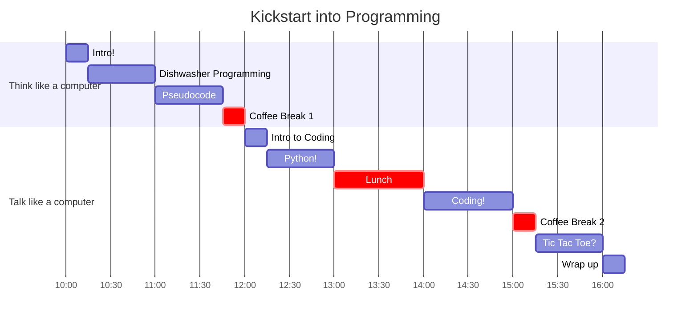

```mermaid
gantt
    title Kickstart into Programming
    dateFormat HH:mm
    axisFormat %H:%M
    section Think like a computer
    Intro!           :a1, 10:00, 15m
    Dishwasher Programming    :a2,  after a1, 45m
    Pseudocode     :a3, after a2  , 45m
    Coffee Break 1      :crit, cb1, 11:45  , 15m
    section Talk like a computer
    Intro to Coding  : a4, after cb1, 15m
    Python! : a5, after a4, 45m
    Lunch               : crit, 13:00,  60m            
    Coding!      :  b1, 14:00  , 60m
    Coffee Break 2      : crit, cb2, 15:00, 15m
    Tic Tac Toe?      : b2, after cb2, 45m
    Wrap up             : 16:00, 15m 
```
